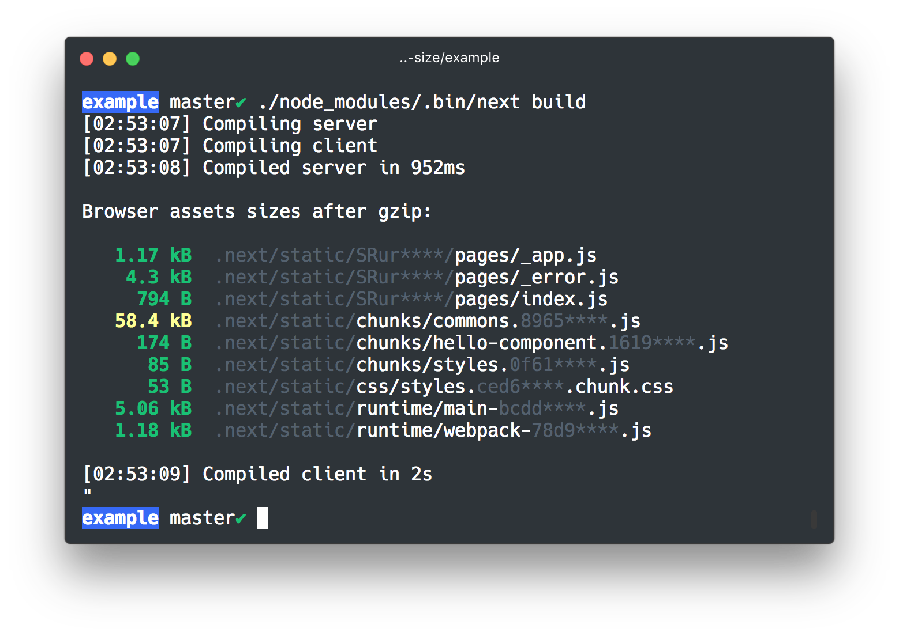

# next-size

**Next-size** is a next.js plugin to **print browser assets sizes** when running `next build`.

<div align="center">

</div>

> 🎁 Check out the [**example folder**](example) folder if you want to try `next-size` (the example includes css and dynamic imports).

### Installation

```
yarn add next-size --dev
```

### Usage

Edit your next configuration and wrap you config with `withSize`.

```js
// next.config.js
const withSize = require('next-size')

module.exports = withSize()
```

The size of the assets created will be showed when you run `next-build`

### Options

You can specify `printRawSize` to print raw asset sizes instead of gzipped sizes.

```js
// next.config.js
const withSize = require('next-size')

module.exports = withSize({
  size: {
    printRawSize: true
  }
})
```

### More

Inspired by :

- create-react-app's [FileSizeReporter](https://github.com/facebook/create-react-app/blob/master/packages/react-dev-utils/FileSizeReporter.js)
- [size-plugin](https://github.com/GoogleChromeLabs/size-plugin) by @developit
